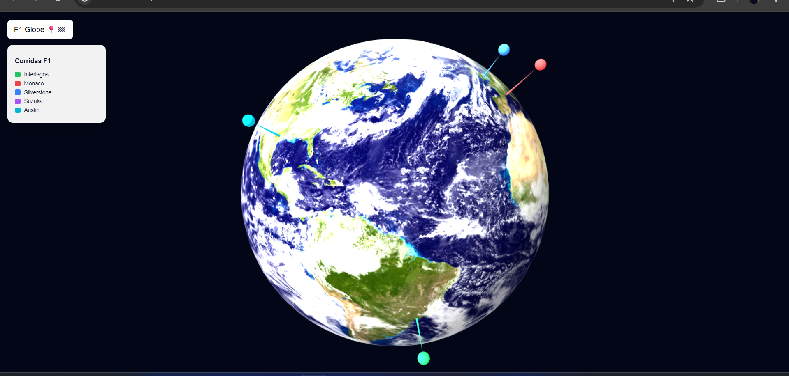

# Globo 3D Interativo — F1 Globe Pins

**Responsável:** Diego Figueiredo Silva 

---

## Relevância

O **F1 Globe Pins** exibe os circuitos de Fórmula 1 sobre um globo terrestre tridimensional e rotativo, permitindo visualizar onde cada corrida acontece no mundo de forma geográfica e interativa. Cada circuito é marcado por um pin com altura proporcional ao número de voltas do circuito.

Essa abordagem contribui para:

- **Contextualização geográfica:** distribuição real dos eventos no planeta
- **Comparação visual:** identificar quais corridas têm maior ou menor valor representado
- **Base reutilizável:** a estrutura pode ser adaptada para qualquer dado com coordenadas geográficas

---

## Como Executar

Para visualizar o globo, abra o arquivo `.html` em um navegador moderno. Recomenda-se usar a extensão **Live Server** no VS Code para garantir o carregamento correto das dependências:

- Instale o Live Server pelo marketplace do VS Code
- Clique com o botão direito no arquivo e selecione **"Open with Live Server"**

---

## Como usar

| Ação | Resultado |
|---|---|
| Arrastar o mouse | Rotaciona a câmera ao redor do globo |
| Scroll do mouse | Aproxima ou afasta a câmera |
| Passar o mouse sobre um pin | Exibe o nome do circuito e o valor associado |

O globo também gira automaticamente de forma contínua. A legenda lateral identifica cada circuito pela cor do seu pin.

---

## Como ler o globo

- **Altura da haste:** proporcional ao número de voltas do circuito, haste mais longa indica valor maior
- **Esfera no topo:** marca visual de cada pin
- **Cor:** identificador exclusivo por circuito, correspondente à legenda

---

## Explicação Técnica e principais diferenças

Estou utilizando as mesmas bibliotecas do projeto anterior — **D3.js** e **Three.js** — com três diferenças principais:

### 1. Superfície esférica

A base é um globo gerado com `SphereGeometry` e textura de satélite, no lugar do plano 2D com GeoJSON. As coordenadas geográficas são convertidas para a superfície da esfera via fórmula trigonométrica (`latLngToSphere`), em vez da projeção Mercator do D3.

### 2. Pins fixados ao globo

Os pins são adicionados como filhos do objeto do globo (`globe.add(group)`), fazendo com que acompanhem automaticamente a rotação sem cálculos extras. Cada pin é orientado radialmente — apontando para fora da superfície — usando `quaternion.setFromUnitVectors`.

### 3. Controles e animações via D3

A animação de entrada dos pins (crescimento do zero) e os controles de câmera (arrasto e zoom) são gerenciados pelo D3 (`d3.drag`, `d3.zoom`, `d3.transition`), mantendo consistência com o projeto anterior.

---

## Imagem

